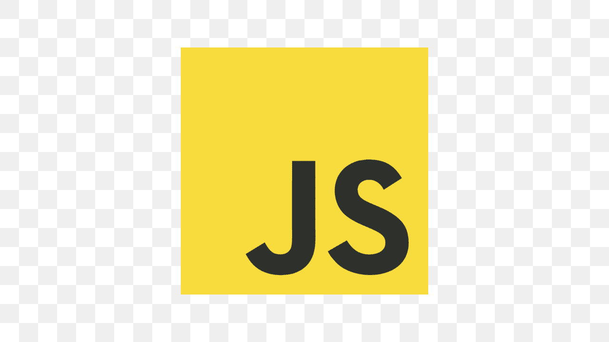

<h1 align="center">42</h1>

This repository is a hub to all my projects from JavaScript course.

  

| Project | Technologies | Description |
|----------|----------|----------|
| [BlogFake](https://github.com/kaiocampos/BlogFake.git)   | JavaScript | implementing requests |

